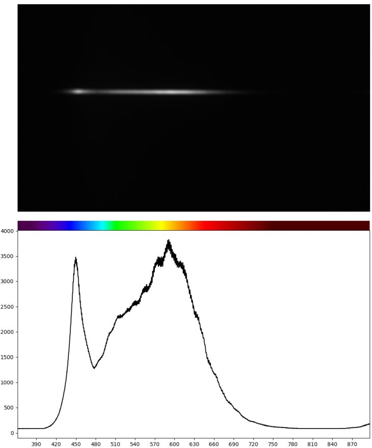

# spectro-l

This simple piece of Python code demonstrates how to acquire images from a spectrometer and plot the calibrated spectrum :rainbow:.

In my case I was using the [M-Spectrometer](https://thunderoptics.fr/product/m-spectrometer/) from ThunderOptics and what I needed was something much simpler than the SpectraGryph software :woozy_face: that they suggest by default. So I simply took the calibration polynomials coefficients, installed the DirectShow camera driver and used OpenCV VideoCapture.

